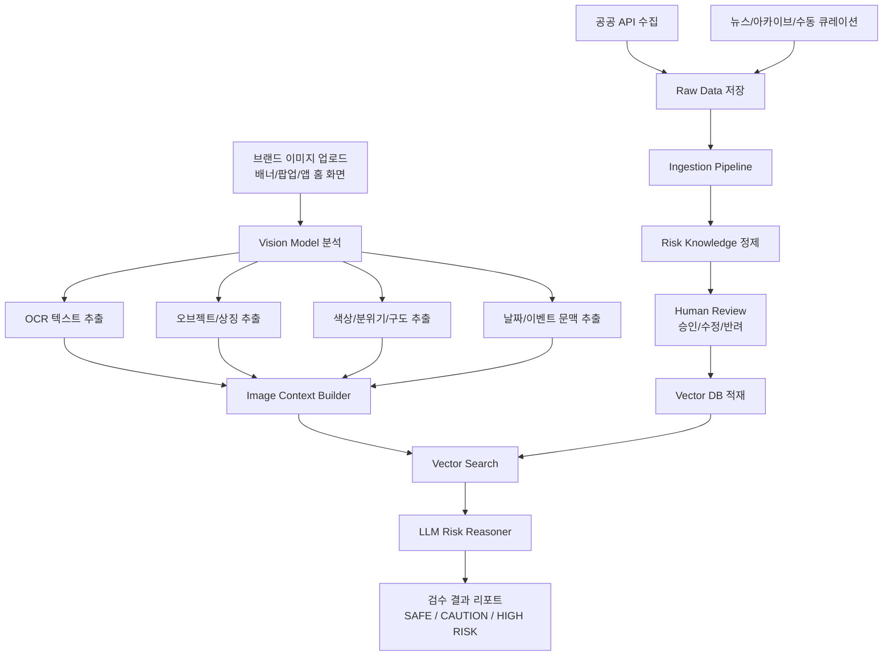
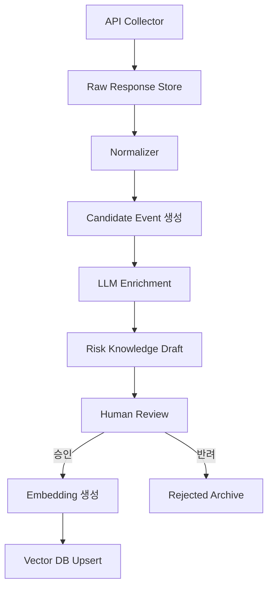
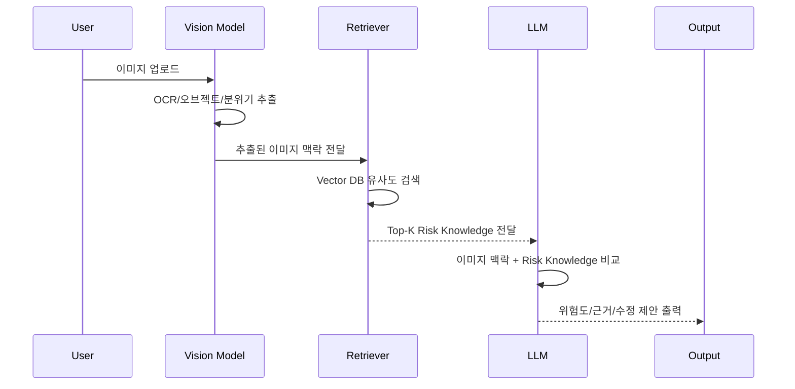

# 브랜드 이미지 평판 검수 에이전트 프로젝트 개요

## 1. 프로젝트 목적

브랜드가 행사, 이벤트, 배너, 팝업, 앱 홈 화면 이미지를 제작할 때  
대한민국 내 민감 사건·사고·역사·재난·차별·혐오 이슈를 연상시키는 요소가 있는지 사전에 검수하는 에이전트를 구축한다.

핵심 목표는 다음과 같다.

| 목표 | 설명 |
|---|---|
| 브랜드 리스크 사전 탐지 | 이미지 공개 전 사회적 논란 가능성 탐지 |
| 인간 검수 보완 | 사람이 놓칠 수 있는 상징, 날짜, 문구, 조합 리스크 보완 |
| 지식 기반 판단 | 공공 API, 뉴스, 수동 큐레이션 기반 Risk Knowledge Base 활용 |
| 설명 가능한 검수 | 왜 위험한지 근거와 유사 사건을 함께 제시 |

---

## 2. 핵심 문제 정의

일반적인 이미지 검수는 아래 항목 중심으로 이루어진다.

- 오탈자
- 디자인 완성도
- 브랜드 가이드 준수
- 문구 적절성
- 법적 표현 문제

하지만 실제 브랜드 이미지 실추는 아래처럼 **맥락 기반 리스크**에서 발생한다.

| 리스크 유형 | 예시 |
|---|---|
| 참사 연상 | 세월호, 이태원 참사, 대형 사고 |
| 역사·민주화 이슈 | 5.18, 4.19, 6월항쟁, 일제강점기 |
| 보훈·안보 이슈 | 천안함, 연평해전, 현충일, 서해수호 |
| 재난·사고 이슈 | 화재, 침수, 지하철 사고, 산업재해 |
| 차별·혐오 이슈 | 성별, 장애, 인종, 종교, 지역, 연령 차별 |
| 상징 오용 | 노란 리본, 검은 리본, 군복, 배, 헬기, 진압 이미지 |

따라서 단순 Vision 분석이 아니라,  
**이미지 → 텍스트/오브젝트 추출 → 민감 이슈 지식 검색 → LLM 추론** 구조가 필요하다.

---

## 3. 전체 시스템 흐름도



---

## 4. 주요 컴포넌트

| 컴포넌트 | 역할 |
|---|---|
| Image Analyzer | 이미지에서 텍스트, 오브젝트, 상징, 분위기 추출 |
| Source Collector | 국가기록원, 인권위, 재난안전, 주요사건/사고 API 수집 |
| Raw Store | 원본 응답 보존. 근거 추적 및 재처리용 |
| Normalizer | API별 응답을 공통 스키마로 변환 |
| Risk Enrichment | 사건을 상징, 금기 조합, 이미지 트리거로 확장 |
| Review Workflow | 사람이 최종 승인한 Risk Knowledge만 운영 반영 |
| Vector DB | 승인된 Risk Knowledge 임베딩 검색 |
| LLM Reasoner | 이미지 맥락과 유사 Risk Knowledge를 기반으로 리스크 판단 |
| Report Generator | 최종 검수 결과, 위험 근거, 수정 제안 생성 |

---

## 5. 데이터 수집 대상

### 5-1. 1차 MVP API

| 사이트 | API / 데이터셋 | 수집 데이터 | 커버 범위 |
|---|---|---|---|
| 공공데이터포털 / 국가기록원 | 나라기록물정보 서비스 | 기록물 제목, 생산기관, 생산연도, 관리번호, 링크 | 5.18, 세월호, 천안함, 민주화운동, 국가 참사 |
| 법제처 국가법령정보 공동활용 | 국가인권위원회 결정문 목록/본문 | 사건명, 사건번호, 의결일자, 판단 요지, 결정문 본문 | 차별, 혐오, 장애, 성별, 인종, 종교, 지역 |
| 재난안전데이터공유플랫폼 | 긴급재난문자 | 재난문자, 발생 시각, 지역, 재난 유형, 알림 문구 | 화재, 침수, 산불, 태풍, 지진, 사회재난 |
| 공공데이터포털 / 한국지역정보개발원 | 주요사건/사고현황 | 지자체, 기관명, 사고 제목, 내용, 연도 | 지하철 사고, 공사장 사고, 산업재해, 공공기관 사고 |

### 5-2. 2차 확장 후보

| 데이터 | 목적 |
|---|---|
| 뉴스토어 / 빅카인즈 | 실제 여론화된 브랜드 논란, 사회적 반응 수집 |
| 4.16재단 / 세월호 아카이브 | 세월호 특화 상징·추모 데이터 보강 |
| 민주화운동기념사업회 오픈아카이브 | 5.18, 4.19, 6월항쟁 등 민주화 이슈 보강 |
| 국가보훈부 데이터 | 천안함, 연평해전, 현충일, 서해수호 이슈 보강 |
| 내부 수동 큐레이션 DB | 사회적 밈, 손동작, 지역 비하, 최근 논란 보완 |

---

## 6. 내부 Vector DB 관리 포맷

Vector DB에는 API 원문을 그대로 넣지 않는다.  
운영에 필요한 Risk Knowledge 형태로 정제한 뒤 적재한다.

### 6-1. Risk Knowledge 스키마

```json
{
  "risk_id": "KR-TRAGEDY-SEWOL-2014",
  "title": "세월호 참사",
  "category": "사회재난/참사/추모",
  "severity": "HIGH",
  "sensitive_dates": ["04-16"],
  "locations": ["전남 진도", "팽목항", "안산", "단원고"],
  "visual_triggers": [
    "노란 리본",
    "종이배",
    "침몰하는 배",
    "구명조끼",
    "바다 위 구조 장면",
    "학생 단체 이미지"
  ],
  "text_triggers": [
    "잊지 않겠습니다",
    "기억하겠습니다",
    "4.16",
    "단원고",
    "팽목항"
  ],
  "risk_patterns": [
    "추모 상징을 할인 이벤트 배너에 사용",
    "참사 연상 이미지를 유머성 문구와 결합",
    "기념일 전후에 해상 사고 연상 이미지를 상업 프로모션에 사용"
  ],
  "safe_usage_notes": [
    "추모 목적이 명확한 경우 별도 검토",
    "상업 프로모션과 결합 시 고위험"
  ],
  "sources": [
    {
      "source": "archives",
      "source_name": "국가기록원",
      "source_id": "record-id",
      "url": "https://..."
    }
  ],
  "status": "APPROVED",
  "version": 1
}
```

---

## 7. Vector DB Collection 설계

### 7-1. Collection 분리

| Collection | 설명 |
|---|---|
| `risk_events` | 사건·사고·역사·재난 중심 Risk Knowledge |
| `risk_symbols` | 노란 리본, 검은 리본, 욱일기 등 상징 중심 데이터 |
| `risk_patterns` | 금기 조합, 문구 조합, 상업적 오용 패턴 |
| `risk_human_rights` | 차별·혐오·인권위 결정문 기반 데이터 |
| `risk_recent_alerts` | 최근 재난문자, 지역 재난, 단기 민감 이슈 |

### 7-2. Payload 필드

| 필드 | 설명 |
|---|---|
| `risk_id` | 내부 Risk Knowledge ID |
| `category` | 참사, 역사, 보훈, 재난, 차별 등 |
| `severity` | LOW / MEDIUM / HIGH / CRITICAL |
| `sensitive_dates` | 민감 날짜 |
| `locations` | 관련 지역 |
| `visual_triggers` | 이미지 오브젝트/상징 |
| `text_triggers` | 문구/키워드 |
| `risk_patterns` | 금기 조합 |
| `source_refs` | 원천 데이터 근거 |
| `status` | DRAFT / PENDING / APPROVED / REJECTED |

---

## 8. Ingestion Pipeline



### 8-1. 단계별 설명

| 단계 | 설명 |
|---|---|
| API Collector | 공공 API, 뉴스 API, 아카이브 데이터 수집 |
| Raw Response Store | 원본 응답 저장. 추후 감사/재처리용 |
| Normalizer | `source`, `title`, `summary`, `category`, `raw` 형태로 통일 |
| Candidate Event 생성 | 사건명, 날짜, 지역, 키워드 후보 추출 |
| LLM Enrichment | 상징, 금기 조합, 이미지 트리거 후보 생성 |
| Human Review | 민감 이슈 담당자가 승인/수정/반려 |
| Embedding 생성 | 승인 데이터만 임베딩 |
| Vector DB Upsert | Collection별 적재 |

---

## 9. LLM Enrichment 프롬프트 방향

LLM은 최종 판단자가 아니라 **정제 보조자**로 사용한다.

### 입력

```json
{
  "title": "세월호 참사 관련 기록물",
  "summary": "해양수산부 | 2014 | 국가기록원 | ...",
  "raw": {}
}
```

### 요청

```text
이 사건을 브랜드 이미지 검수 지식으로 재가공해라.

다음 항목을 추출한다.
1. 사건 분류
2. 민감 날짜
3. 관련 지역
4. 이미지에서 연상될 수 있는 시각 요소
5. 텍스트에서 연상될 수 있는 문구
6. 브랜드 이벤트에서 금기 조합이 될 수 있는 패턴
7. 위험도
8. 사람이 검수해야 할 불확실한 항목
```

### 출력

```json
{
  "category": "사회재난/참사/추모",
  "sensitive_dates": ["04-16"],
  "visual_triggers": ["노란 리본", "침몰하는 배", "구명조끼"],
  "text_triggers": ["기억하겠습니다", "잊지 않겠습니다"],
  "risk_patterns": [
    "추모 상징을 할인 이벤트와 결합",
    "참사 연상 이미지를 유머 문구와 결합"
  ],
  "severity": "HIGH",
  "needs_human_review": true
}
```

---

## 10. 이미지 검수 시 LLM 최종 판단 흐름



---

## 11. 최종 응답 포맷

LLM은 단순히 “위험함/안전함”만 말하면 안 된다.  
실무자가 바로 판단할 수 있도록 아래 구조로 응답한다.

```json
{
  "risk_level": "CAUTION",
  "score": 72,
  "summary": "이미지의 노란 리본과 바다 배경이 세월호 추모 맥락을 일부 연상시킬 수 있습니다.",
  "matched_risks": [
    {
      "risk_id": "KR-TRAGEDY-SEWOL-2014",
      "title": "세월호 참사",
      "matched_elements": ["노란 리본", "바다", "추모성 문구"],
      "reason": "상업 이벤트 배너에서 추모 상징이 사용될 경우 브랜드 리스크가 발생할 수 있습니다."
    }
  ],
  "recommendations": [
    "노란 리본 형태의 장식 요소를 일반 리본 또는 다른 색상으로 변경",
    "바다/선박 연상 이미지를 제거",
    "프로모션 문구와 추모성 문구가 결합되지 않도록 수정"
  ],
  "requires_human_review": true
}
```

---

## 12. MVP 범위

### 포함

| 항목 | 포함 여부 |
|---|---:|
| API 수집기 | 포함 |
| 공통 정규화 스키마 | 포함 |
| Risk Knowledge 포맷 | 포함 |
| LLM Enrichment 설계 | 포함 |
| Vector DB 적재 설계 | 포함 |
| 이미지 검수 응답 포맷 | 포함 |

### 제외

| 항목 | 제외 이유 |
|---|---|
| 완전 자동 승인 | 민감 이슈 오판 가능성 |
| 뉴스 API 실연동 | 별도 계약/신청 필요 |
| 실시간 브랜드 송출 차단 | PoC 이후 운영 단계 |
| 법적 최종 판단 | 법무/브랜드 담당자 검토 필요 |

---

## 13. 최종 결론

이 프로젝트의 핵심은 Vision Model 자체보다  
**Risk Knowledge Base의 품질과 정제 파이프라인**이다.

공공 API로 사건·사고·인권·재난 데이터를 수집하고,  
LLM으로 상징·금기 조합·이미지 트리거 후보를 생성한 뒤,  
사람이 승인한 데이터만 Vector DB에 적재해야 한다.

최종 에이전트는 이미지 속 요소와 Risk Knowledge를 비교하여  
브랜드 이미지 실추 가능성을 사전에 경고하고,  
실무자가 바로 수정할 수 있는 근거와 대안을 제공한다.
